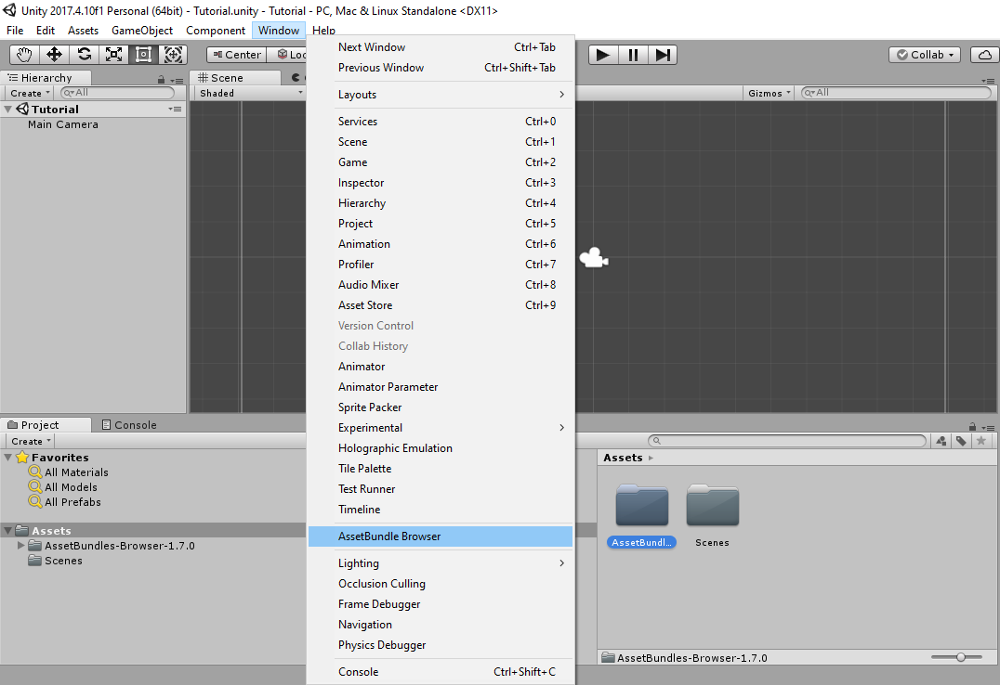
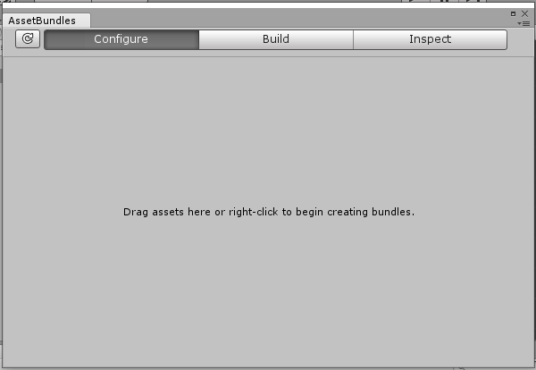
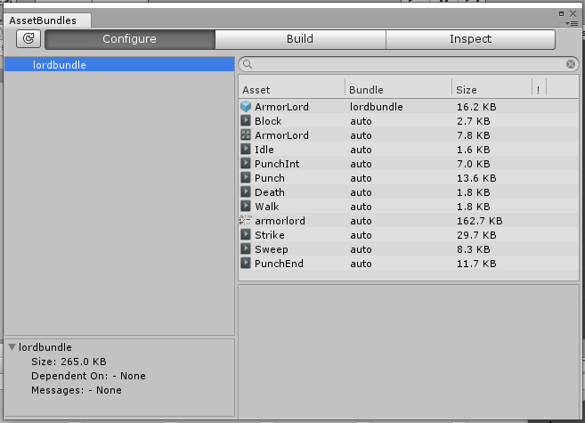
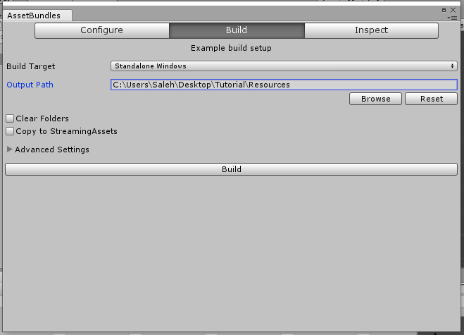

Custom Assets
=============

Editing FSMs all day and night is nice and all but it isn't very useful if you want to add anything completely new to the game.
Today, we will learn about the magic of assetbundling and get you started on making your own mod in Unity! And to make things even more interesting, 
I will guide you through adding your own custom enemy into the game.

What you will need
^^^^^^^^^^^^^^^^^^
* `Unity version 2017.4.10f <https://unity3d.com/get-unity/download/archive>`_
* `Assetbundle Browser <https://github.com/Unity-Technologies/AssetBundles-Browser/releases>`_
* `Armor Lord Spritesheet <https://www.spriters-resource.com/fullview/132855/>`_

.. note::
    In the Unity installer, make sure that you choose to install build support for Windows, Linux, and Mac.

AssetBundles
^^^^^^^^^^^^
Assetbundles are a form of archive file that allow us to export our Unity content and import them into our game while it runs.
This means that we can make whatever we want in Unity and tranfer that into Hollow Knight.

Assetbundling non-scene stuff
^^^^^^^^^^^^^^^^^^^^^^^^^^^^^

The easiest way to manage assetbundles is through the Assetbundle Browser. After creating a Unity project (in 2D mode), simply drag the 
extracted Assetbundle Browser folder into your Unity project's Assets folder. After it loads, this should create an "AssetBundle Browser" option 
when you open up the Window list as seen in figure 1.

   Figure 1: Notice the AssetBundle Browser option in the Window list.

Creating our enemy in Unity
^^^^^^^^^^^^^^^^^^^^^^^^^^^
Before we can assetbundle anything, we need to have something to assetbundle, I will be recreating the Armor Lord from Symphony of the Night but you can do something else.

I'm assuming you know how to use Unity so I will only a give a few tips/warnings. 

* When you are changing the spritesheet settings after you import, be sure to set **Filter Mode** to *Point* if you are dealing with pixel art, otherwise keep it at *Bilinear*. 
* If your spritesheet is very large, be sure to change the **Max Size** option to a higher amount.
* In my experience, managing the Animator Controller is very annoying so don't do anything with it, just create your clips and run the different animations through code (i.e. :code:`_anim.Play("Animation")`)
* ModCommon has extensions that are useful when working with the Animator component (IsPlaying(), PlayAt(), and GetCurrentFrame()).

.. raw:: html

   <iframe width="426" height="240" src="https://www.youtube.com/embed/QEVqxdLWKAk" frameborder="0" allow="accelerometer; autoplay; encrypted-media; gyroscope; picture-in-picture" allowfullscreen></iframe>

When you finish, create a prefab of your boss by dragging it from the Hierarchy menu into one of your project's folders. 

Creating the assetbundle
^^^^^^^^^^^^^^^^^^^^^^^^
Open the AssetBundle Browser menu (Window -> AssetBundle Browser). You should see the screen in figure 2.

   Figure 2: The AssetBundle Browser window.

Right click on the window and select "Add new bundle." I will name my bundle "lordbundle," but you can choose something else. 
Now drag your prefab or any other asset you want to export, into the bundle you just made. 

   Figure 3: Your window after you drag your content into it.

Head over to the **Build** tab of the window and choose your modding project's directory (or a folder in it) as the *Output Path*.
The *Build Target* does not matter unless you bundle shaders, in which case, you will need to build separate assetbundle files for Linux, Windows, and Mac.
Click build and wait for the magic to happen.

   Figure 4: The build tab of the Assetbundle Browser.

The AssetBundle Browser will create multiple files once the building is done but you only need the file named after your bundle, in my case it is "lordbundle."

.. note:: 
   Unity does not assetbundle script files so you will need to add those using AddComponent<T>() in your mod's code. 

Loading assetbundle into Hollow Knight
^^^^^^^^^^^^^^^^^^^^^^^^^^^^^^^^^^^^^^
Add your assetbundle file as an embedded resource to your project by adding the following to your project's .csproj file. 

.. code-block:: 

  <ItemGroup>
	<EmbeddedResource Include="path-to-file-in-project\lordbundle" />
  </ItemGroup>

Read the assetbundle using :code:`Assetbundle.LoadFromMemory()`, like so:

.. code-block:: c#

   string bundleN = "lordbundle";
   AssetBundle ab = null;
   Assembly asm = Assembly.GetExecutingAssembly();
   foreach (string res in asm.GetManifestResourceNames())
   {
      using (Stream s = asm.GetManifestResourceStream(res))
      {
            if (s == null) continue;
            byte[] buffer = new byte[s.Length];
            s.Read(buffer, 0, buffer.Length);
            s.Dispose();
            string bundleName = Path.GetExtension(res).Substring(1);
            if (bundleName != bundleN) continue;
            Log("Loading bundle " + bundleName);
            ab = AssetBundle.LoadFromMemory(buffer); // Store this somewhere you can access again.
      }
   }

Loading content from bundle
^^^^^^^^^^^^^^^^^^^^^^^^^^^
There are different methods for loading our assets depending on what we want to do.
The simplest is the method :code:`ab.LoadAsset<T>("ObjectName")` which allows us to load a single Unity object that we want(audioclip, prefab, shader, material, etc.)
based on its name. So to load the Armor Lord prefab I made, I could do :code:`ab.LoadAsset<GameObject>("ArmorLord")`.

Another useful method is :code:`ab.LoadAllAssets<T>()` which returns an array of all your assets that are type T. 
If I had a bunch of materials that I wanted to store, I could do :code:`ab.LoadAllAssets<Material>()`. 
There is also a non-generic version of this method that will load all the objects in your bundle into an array.

You can add Async to the end of these methods to continue through your code without waiting for the assets to load.

Using our loaded stuff 
^^^^^^^^^^^^^^^^^^^^^^
Not much here since you do all this as you normally would. Instantiate your prefab, set its position, make it active, add your MonoBehaviour to it, and so on.
But there is something important you still need to do so read the Warning.

.. warning::
   For some strange and stupid reason that only the greatest of Unity gods will ever fathom, Unity loses the link between a gameobject and its material in SpriteRenderers.
   Thus, if your gameobjects use a SpriteRenderer component, you need to link them back to the material with something along the lines of
   :code:`go.GetComponent<SpriteRenderer>().material = new Material(Shader.Find("Sprites/Default"));`. The shader inside the new material's constructor depends on what you chose so don't just copy this.

.. note::
   You need to add the Hollow Knight specific stuff here as well such as the DamageHero and HealthManager components as well as set the gameobject's layer to 11.

Armor Lord Example
^^^^^^^^^^^^^^^^^^

.. raw:: html

   <iframe width="426" height="240" src="https://www.youtube.com/embed/026NBM3ikCo" frameborder="0" allow="accelerometer; autoplay; encrypted-media; gyroscope; picture-in-picture" allowfullscreen></iframe>

* `Get the Unity project <https://drive.google.com/file/d/1iBCZHp-Rsm-ZGxXeSwodHAOPibn9dCp3/view?usp=sharing>`_
* `ArmorCtrl.cs code <https://gist.github.com/SalehAce1/0448a531e9d179dc5ef8910ccfebdc2b>`_

Code I used to load the prefab.

.. code-block:: c#

   AssetBundle ab = Tutorial.assetbundles["lordbundle"];
   GameObject go = Instantiate(ab.LoadAsset<GameObject>("ArmorLord"));
   go.SetActive(true);
   go.transform.position = HeroController.instance.transform.position;
   go.GetComponent<SpriteRenderer>().material = new Material(Shader.Find("Sprites/Default"));
   go.AddComponent<ArmorCtrl>();
