Modifying Scenes through Utiny Ripper and Assetbundling
=======================================================

Introduction
^^^^^^^^^^^^
Modifying prexisting scenes in Hollow Knight can involve a variety of things, from changing NPC locations and reordering platforms to adding new enemies and completely overhauling areas.
The process behind editing levels is equally diverse with the simplest methodology requiring you to create and position everything manually with code. 
While this approach requires less setup, a more elegant approach exists. This guide will teach you to use a software called **Utiny Ripper** to export
scenes from Hollow Knight into the game engine Unity, edit your level there, and import your new level back into Hollow Knight.
By the end of this tutorial, you should be able to accomplish all of these tasks with limited extra help needed. 
We will be editing the **Abyss_09** scene.

.. note::
    While adding new scenes is relatively simple, editing old ones can be both tedious and difficult depending on the scene you choose and how much you wish to change.
    My hope is that this guide will eventually become mostly obsolete once Nes finishes his HK-World-Edit mod. 

Background
^^^^^^^^^^
You cannot edit scenes without having a good understanding of the various aspects that run Hollow Knight and its mods. 
Therefore, this guide recommends and expects that you have already worked with the following topics:
* Understanding the structure of a basic mod.
* Having basic Unity knowledge.
* Knowing how to create new scenes.
* Understanding assetbundling.
* Having the ability to preload gameobjects.
* Knowing how to modify PlayMakerFSM.

.. note::
    You will also need the ability to choose between reimplementing certain behaviors/object yourself or copying them using preloading.

.. note::
    With the exception of basic Unity knowledge, all other topics listed are explained, either through video or text, on this site. 
    If you still need assistance, don't be afraid to ask on Discord.

What you will need
^^^^^^^^^^^^^^^^^^
* `Utiny Ripper <https://sourceforge.net/projects/utinyripper/files/>`_
* `Unity version 2017.4.10f <https://unity3d.com/get-unity/download/archive>`_
* `Assetbundle Browser <https://github.com/Unity-Technologies/AssetBundles-Browser/releases>`_

Export with Utiny Ripper
^^^^^^^^^^^^^^^^^^^^^^^^
1) After downloading the latest version of Utiny Ripper, open **uTinyRipper.exe**. You should be greeted with the screen in figure 1.

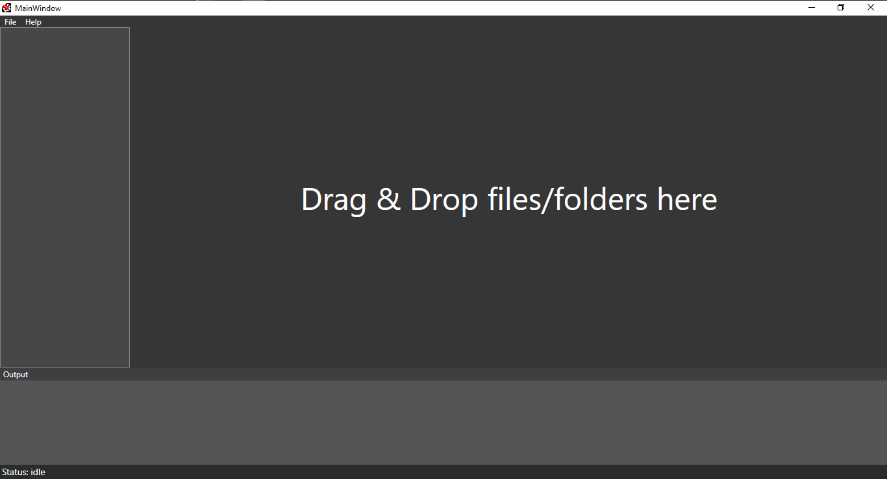

   Figure 1: Screenshot of the Utiny Ripper screen.

2) Find your main Hollow Knight folder which should be in the following path: :code:`\Program Files (x86)\Steam\steamapps\common\Hollow Knight`.

.. note::
    The path may be different if you are using a non-standard steam path or a DRM-free version of the game.

3) Drag your Hollow Knight folder into Utiny Ripper; figure two shows what you should see.

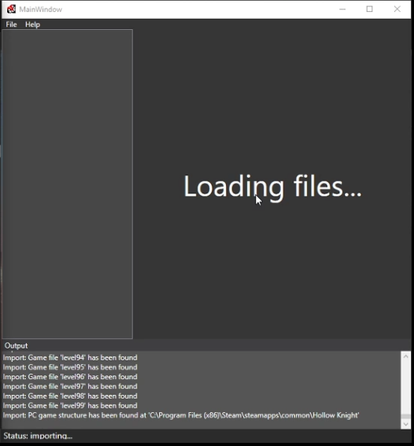

   Figure 2: Screenshot of the Utiny Ripper importing Hollow Knight data.

4) Wait until your Utiny screen changes to figure 3. Once this has happened, click the **Export** button. 

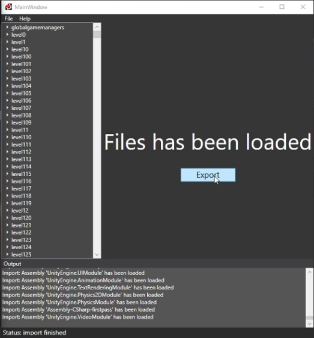

   Figure 3: Utiny waiting for you to export the Hollow Knight data.

5) As in figure 4, choose a location where you want the new Unity project to be made in.

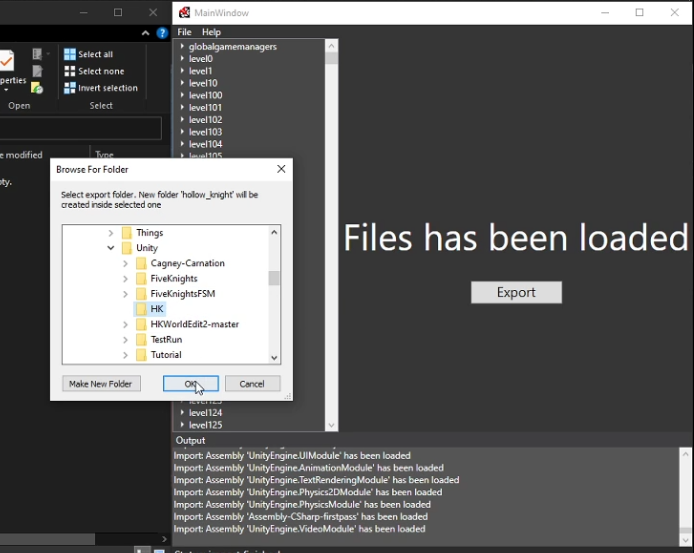

   Figure 4: Setting the export path of the new Unity project.

6) Now wait for Utiny to finish exporting. Once that is done, you should be prompted with a screen that says **Export is finished**. You are now ready to move on to the next step.

.. note::
    This process can take longer than 30 minutes so don't be worried if it takes a while.

Unity project setup
^^^^^^^^^^^^^^^^^^^
7) Open up the new project using Unity. If you are greeted with the message in figure 5, simply press **Continue**.

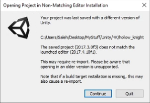

   Figure 5: Unity warning incorrectly telling you that you might not have the right version of Unity.

8) Wait for the Unity project to load. Once done, your Unity project should look like figure 6.

.. note::
    This step may take longer than 1.5 hours, especially if your computer has an old processor.

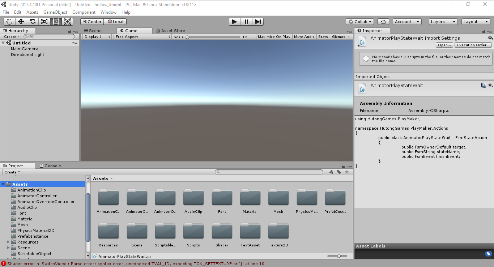

   Figure 6: Your Unity project.

9) Our first task is to start fixing some of the errors. Open the console and find all :code:`Object is an ambiguous reference` errors. Click on one of them.

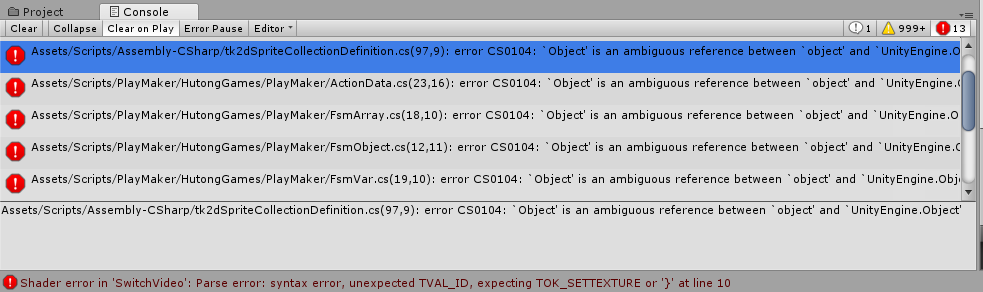

   Figure 7: Unity console.

10) When your default IDE opens, fix the problem by adding :code:`using Object = UnityEngine.Object` to the top of the program.

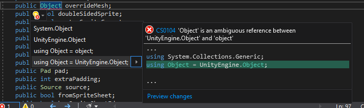

   Figure 8: How to fix the ambiguous object error.

11) Repeat steps 9 and 10 until all :code:`Object is an ambiguous reference` errors are gone.

.. note::
    You will still have plenty of errors left but none of those will stop us from assetbundling so they don't matter.

Adding a pre-existing scene to the game
^^^^^^^^^^^^^^^^^^^^^^^^^^^^^^^^^^^^^^^
12) Find and open the **Abyss_09** in the path :code:`Assets->Scene->Scenes->Abyss->Abyss_09`.

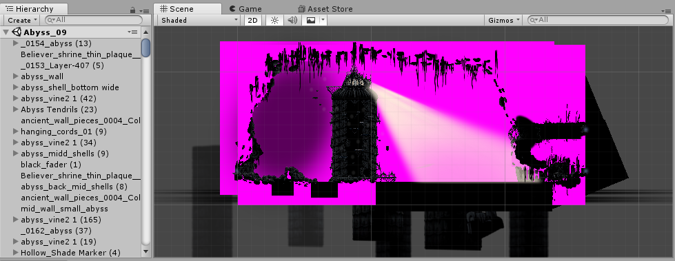

   Figure 9: The Abyss_09 scene without any edits.

.. note::
    Unity will automatically have you in 3D mode so don't forget to switch back to 2D. 

13) We don't want to edit the original scene in case we mess up and need to go back so we need to create a new Unity scene.
Click on an object in the **Hierarchy** menu and use CTRL-A to select all the objects. Now copy all the objects with a CTRL-C. 

.. figure:: resources/editscene/scene2.PNG
   :scale: 100 %

   Figure 10: Copying all objects in Abyss_09.

14) In whichever folder you desire, right click, go on **Create**, and choose **Scene**. I will name mine **TestAbyss**.

.. warning:: 
    Make sure you do not name your new scene the same name as a scene that already exists in the game. 

15) Open your new scene and paste the copied content into it. 

.. figure:: resources/editscene/scene3.PNG
   :scale: 100 %

   Figure 11: Pasting all objects in to TestAbyss.

16) Now we want to edit the lighting of the scene to match the game. On the top ribbons, go to :code:`Window->Lighting->Settings`.

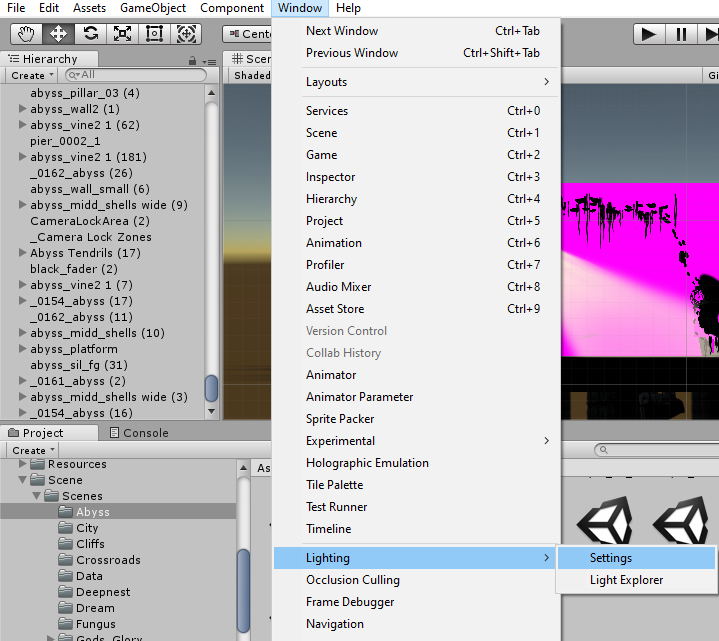

   Figure 12: Path to lighting settings.

17) Match your settings with the ones in figure 13 then click **Generate Lighting**.

.. figure:: resources/editscene/scene5.PNG
   :scale: 100 %

   Figure 13: Lighting settings.

18) With everything saved, Assetbundle your scene using the AssetBundle Browser.

.. note::
    If you don't remember how to assetbundle, `watch this video at timestamp 8:55 <https://radiance.host/apidocs/Assets.html#assetbundling-scenes>`_.

19) The code for loading the assetbundling will also be the same as the new scene tutorial.

20) We will start out with a very simple program for loading our scene. 

.. code-block:: c#

    public class LoadScene : MonoBehaviour
    {
        private IEnumerator Start()
        {
            // Do not switch scenes until the user presses R
            yield return new WaitWhile(() => !Input.GetKey(KeyCode.R));
            
            // Loads the scene "TestAbyss"
            // Found the gate name by looking up  "left" on the Unity project.
            GameManager.instance.BeginSceneTransition(new GameManager.SceneLoadInfo
            {
                SceneName = "TestAbyss",
                EntryGateName = "left1",
                EntryDelay = 0,
                Visualization = GameManager.SceneLoadVisualizations.Default,
                WaitForSceneTransitionCameraFade = false,
                PreventCameraFadeOut = true
            });
        }
    }

21) You should get something like the video below when testing your mod.

.. raw:: html

    <iframe width="560" height="315" src="https://www.youtube.com/embed/FEkKUpUlagU" frameborder="0" allow="accelerometer; autoplay; encrypted-media; gyroscope; picture-in-picture" allowfullscreen></iframe>

Fixing material issues
^^^^^^^^^^^^^^^^^^^^^^
22) In the **Hierarchy**, select one of the objects with **chunk** in its name. 

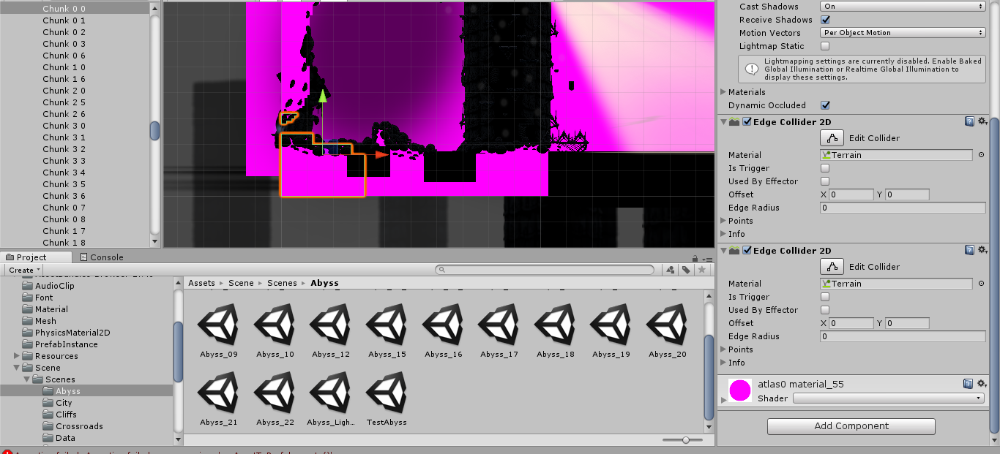

   Figure 14: One of the chunks selected.

23) At the end of the object's **Inspector**, there should be a component named :code:`atlas0 material_55`. 
Click on its **Shader** property and choose :code:`Sprites->Default`. 

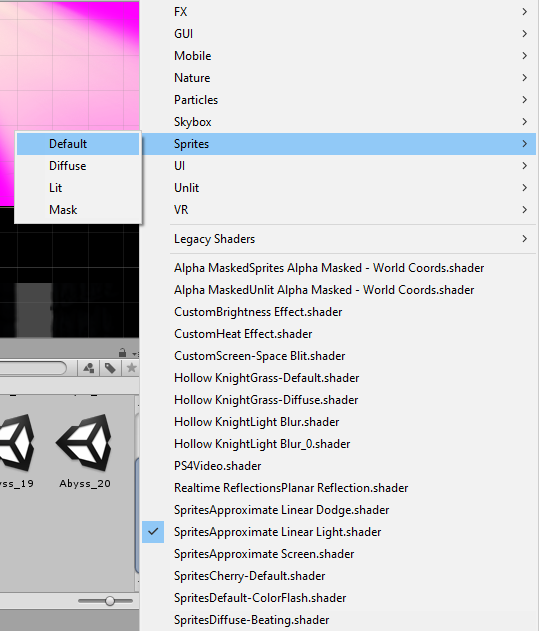

   Figure 15: One of the chunks selected.

24) We'll "fix" the tendrils by simply deleting them. Select all **Abyss Tendrils** on the Hierarchy and delete them. 

25) We'll do the same with the Sibling enemies. Delete all **Shade Sibling** as well as the **Siblings** parent from the Hierarchy.

.. note::
    If we wanted siblings and enemies to be a part of our mod, we would either have to recreate these enemies in Unity or we could use preloading to get the originals from the game.

26) To get the background blur (**BlurPlane**) working, we have three different options.

    a) Find or create a shader similar to the one `Team Cherry used <https://forum.unity.com/threads/simple-optimized-blur-shader.185327>`_.

    b) Using code, change the current BlurPlane's material settings to match the game's settings.

    c) Use preloading to replace the bad BlurPlane with the original one.

28) I will go with option c in this tutorial. All you need to do is preload the BlurPlane from :code:`("Abyss_09","BlurPlane")`. 
Now we update our LoadScene class to:

.. code-block:: c#

    private IEnumerator Start()
    {
        // Do not switch scenes until the user presses R
        yield return new WaitWhile(() => !Input.GetKey(KeyCode.R));
        
        // Loads the scene "TestAbyss"
        // Found the gate name by looking up  "left" on the Unity project
        GameManager.instance.BeginSceneTransition(new GameManager.SceneLoadInfo
        {
            SceneName = "TestAbyss",
            EntryGateName = "left1",
            EntryDelay = 0,
            Visualization = GameManager.SceneLoadVisualizations.Default,
            WaitForSceneTransitionCameraFade = false,
            PreventCameraFadeOut = true
        });
        
        GameObject blur = null;
        // Wait until BlurPlane is found
        yield return new WaitWhile(() => !(blur = GameObject.Find("BlurPlane")));
        // Destroy it and create a new BlurPlane from our Preloaded object
        Destroy(blur);
        blur = Instantiate(SceneTutorial.blur);
        blur.SetActive(true);
        blur.transform.position = new Vector3(111.5f, 65.3f, 10.9f);
        blur.transform.localRotation = Quaternion.Euler(-180f, -90f, 90f);
        blur.transform.localScale = new Vector3(11.48f, 11.48f, 25.01f);
    }

Editing to the scene
^^^^^^^^^^^^^^^^^^^^
29) Since we don't want people climbing the lighthouse, 
we will delete all the platforms with the exception of :code:`lighthouse_04 (2)` which we will use later. 
I put mine at position (30,22) so that it's right infront of the entrance.

30) You can get a bit creative here but I decided to remove the lighthouse and use its head as the end of the pier. 
If I were making a real mod, I would connect the entrance of the top of the lighthouse to a new room but for simplicity's sake, I won't be doing that here.

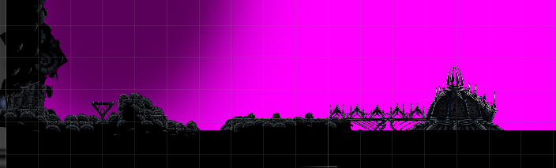

   Figure 16: My edited abyss room.

31) With your changes done, assetbundle and compile your code to see if it is working. You should get something similar to what's below.

.. raw:: html

    <iframe width="426" height="240" src="https://www.youtube.com/embed/mYsh8IuSlS0" frameborder="0" allow="accelerometer; autoplay; encrypted-media; gyroscope; picture-in-picture" allowfullscreen></iframe>

Congratulations, you modded your first Hollow Knight scene!

Fixing audio
^^^^^^^^^^^^
.. note::
    All scenes have a SceneManager object that controls various aspects of each scene (lightning, color, saturation, music, and more).

32) We can fix the audio and sound of our scene by replacing the exported SceneManager with one that is from the original game (once again with preloading).
Your intuition might tell you to get the SceneManager from **Abyss_09** but this won't work. 
If you look at the **Inspector** properties of the **_SceneManager** gameobject in our scene (figure 17), 
you will find that the **Atmos Cue** and **Music Cue** properties are empty. 
This is because the music is set by the SceneManager in room **Abyss_06_Core** so we preload with :code:`("Abyss_06_Core","_SceneManager")`.

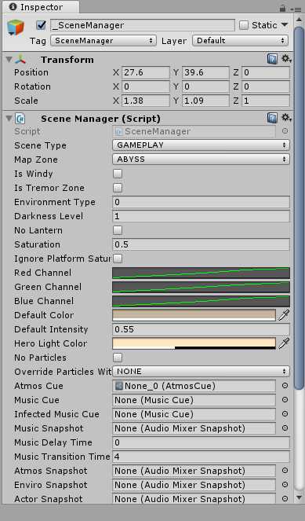

   Figure 17: SceneManager properties for Abyss_09.

33) Replace the SceneManager with the one you preloaded using the following code:

.. code-block:: c#

    // When we get to our scene, replace the SceneManager.
    UnityEngine.SceneManagement.SceneManager.activeSceneChanged += (arg0, scene1) =>
    {
        if (scene1.name == "TestAbyss")
        {
            Destroy(GameObject.Find("_SceneManager"));
            GameObject s = Instantiate(SceneTutorial.sm);
            s.name = "_SceneManager";
            s.SetActive(true);
        }
    };

Fixing miscellaneous gameobject issues
^^^^^^^^^^^^^^^^^^^^^^^^^^^^^^^^^^^^^^
By now, you have probably noticed that most objects that are not static sprites break (void water won't splash, breakable objects turn pink, and more).
Our two main options for fixing these are preloading and reimplementing them ourselves in Unity. Reimplementing is a bit more 
efficient performance-wise but preloading is easier so we will go with that.

Breakable Shells
~~~~~~~~~~~~~~~~

34) The first step is to find the path of the object you want to replace in the scene.
For the breakable shells, this is **Ruins Fossil** so all we need to preload is :code:`("Abyss_09","Ruins Fossil")`.

35) Now in our code, we loop through all of the breakable shells and replace.

.. code-block:: c#

    foreach (GameObject i in FindObjectsOfType<GameObject>()
        .Where(x => x.name.Contains("Ruins Fossil")))
    {
        GameObject shell = Instantiate(SceneTutorial.ReplaceAssets["shell"]);
        shell.transform.position = i.transform.position;
        shell.transform.localRotation = i.transform.localRotation;
        shell.transform.localScale = i.transform.localScale;
        shell.name = i.name;
        shell.SetActive(true);
        Destroy(i);
    }

Tink Effects
~~~~~~~~~~~~~
While the tink itself works, the effect it's supposed to create does not, which tells us that the problem is with the 
**Block Effect** property within the **Tink Effect** component. 

36) Preload a gameobject that uses it from the **Abyss_09** scene; I chose :code:`("Abyss_09","tinker lite")`.

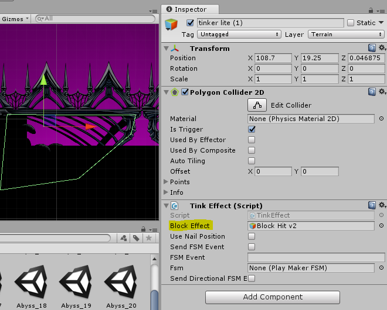

   Figure 18: An example of a Tink Effect component.

37) Loop through all gameobjects with a **TinkEffect** component and replace their **blockEffect** property with the original one.

.. code-block:: c#

    TinkEffect orig = SceneTutorial.ReplaceAssets["tink"].GetComponent<TinkEffect>();
    foreach (TinkEffect i in FindObjectsOfType<TinkEffect>())
    {
        i.blockEffect = orig.blockEffect;
    }

Water Splash
~~~~~~~~~~~~
In this scene, water works using two different gameobjects, **abyss_black-water** and **Surface Water Region**. Similar to how we fixed breakable shells, we will find and replace these gameobjects.

38) Preload them with :code:`("Abyss_09","Surface Water Region")` and :code:`("Abyss_09", "abyss_black-water")`.

39) There is only one **abyss_black-water** so we do not need to loop when replacing.

.. code-block:: c#

    GameObject water = Instantiate(SceneTutorial.ReplaceAssets["water"]);
    GameObject waterOrig = GameObject.Find("abyss_black-water");
    water.transform.position = waterOrig.transform.position;
    water.transform.rotation = waterOrig.transform.rotation;
    water.transform.localScale = waterOrig.transform.localScale;
    water.name = waterOrig.name;
    water.SetActive(true);
    Destroy(waterOrig);

40) Loop through all gameobjects that have the name **Surface Water Region** in them, and replace them with their original version.

.. code-block:: c#

    foreach (GameObject go in FindObjectsOfType<GameObject>()
        .Where(x => x.name.Contains("Surface Water")))
    {
        Modding.Logger.Log("BRUUDUADUAU " + go.name);
        GameObject surface = Instantiate(SceneTutorial.ReplaceAssets["water_region"]);
        surface.transform.position = go.transform.position;
        surface.transform.localScale = go.transform.localScale;
        surface.transform.rotation = go.transform.rotation;
        surface.SetActive(true);
        Destroy(go);
    }

.. raw:: html

    <iframe width="426" height="240" src="https://www.youtube.com/embed/pubdSXLk-38" frameborder="0" allow="accelerometer; autoplay; encrypted-media; gyroscope; picture-in-picture" allowfullscreen></iframe>

Replacing old room with our new one
^^^^^^^^^^^^^^^^^^^^^^^^^^^^^^^^^^^
Currently, if we go from the scene before **Abyss_09** (**Abyss_16**) to **Abyss_09**, the player will go to the original scene, not ours. 

41) Fix this by hooking to BeginSceneTransition and loading our scene whenever the game tries to put the player in **Abyss_09**.

.. code-block:: c#

    On.GameManager.BeginSceneTransitionRoutine += GameManagerOnBeginSceneTransitionRoutine;

    // ...

    private IEnumerator GameManagerOnBeginSceneTransitionRoutine(On.GameManager.orig_BeginSceneTransitionRoutine orig, GameManager self, GameManager.SceneLoadInfo info)
    {
        // If going to Abyss_09, go to TestAbyss instead.
        info.SceneName = info.SceneName == "Abyss_09" ? "TestAbyss" : info.SceneName;
        yield return orig(self, info);
    }

.. raw:: html

    <iframe width="426" height="240" src="https://www.youtube.com/embed/O_nSYGb6BCQ" frameborder="0" allow="accelerometer; autoplay; encrypted-media; gyroscope; picture-in-picture" allowfullscreen></iframe>

And that's everything, hopefully this guide has taught you how to edit Hollow Knight scenes and has given you an idea of what you need to do to fix common issues that might popup with your scene.

`Find the entire program along with the assetbundle and Unity scene here <https://github.com/SalehAce1/HKEdit-Tutorial>`_