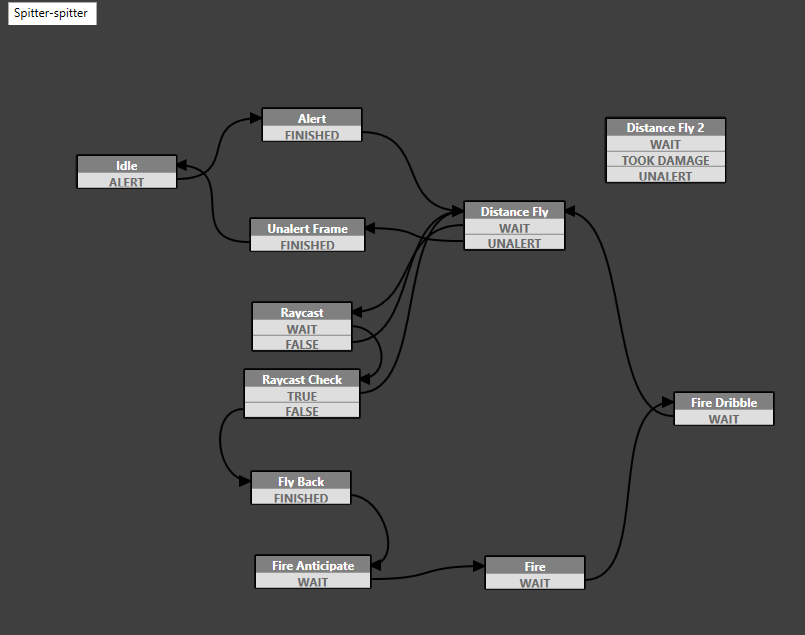
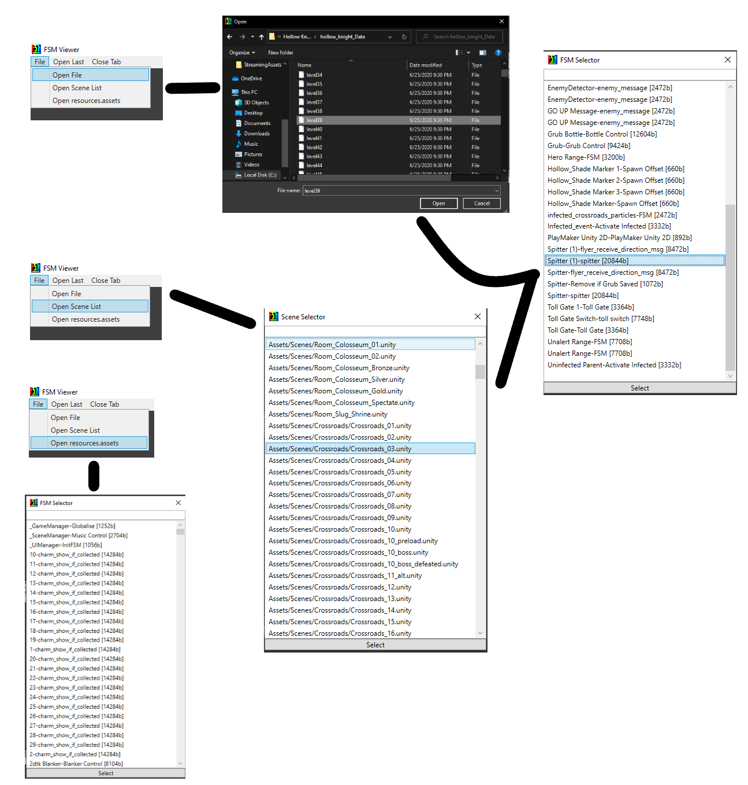
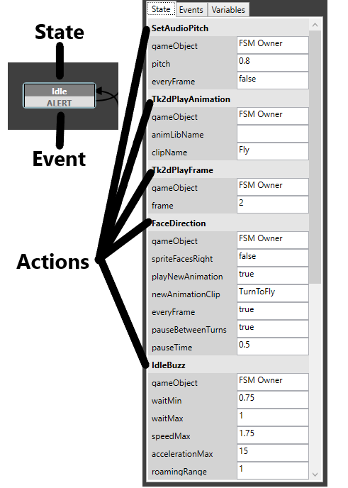

PlaymakerFSM
============

PlaymakerFSM is a visual scripting language Team Cherry uses for much of their behavior control, and while editing these can be annoying, thankfully, we have tools that will help us do it.

Nesrak's PlaymakerFSM Viewer
^^^^^^^^^^^^^^^^^^^^^^^^^^^^
The FSM Viewer_ allows us to look at the diagram that makes up each FSM.

   Figure 1: A screenshot of the Aspid Hunter's FSM. 

To use it, click on File, which leads you to three different options, "Open File," "Open Scene List," and "Open resources.assets."
The first option lets you select the file/scene you want manually from the HollowKnight_Data folder. 
The second lists all of the game's scenes for you to pick from, then it gives a list of all the gameobjects in that scene with their FSM
The third lists FSMs from the resources.assets file, these are all the general FSMs that are with you in every scene, such as different charm effects.
The FSM Viewer formats the FSMs like so: "Gameobject_Name-FSM_Name".

   Figure 2: Order of managing PlaymakerFSM. 

I will use the Aspid Hunter's main FSM as an example from here on out. You can find it in the scene "Crossroads_03" with the name "Spitter-spitter." 
Now for some terminology. Each box you see is called a **state** with each state having several **actions** and **events**. 

   Figure 3: State, Event, and Action labels. 

Actions
~~~~~~~
Actions are what the state will do and they run from top to bottom starting from index 0. 
There are many different actions but what they do should usually be fairly easy to understand, if not, you can always use DnSpy to look at their code.

Events
~~~~~~
Events are used to tell the FSM which state it should go to next.
The *FINISHED* event is something like a default event. When a FSM finishes all of its actions and it has a *FINISHED* event, it will go to where that event points.
For example, when the state **Alert** finishes all of its actions, because of the *FINISHED* event, the FSM moves on to the state **Distance Fly**.
On the other hand, if a state has no *FINISHED* event and has something else instead, the FSM will only move on when that event is run.
For example, the state **Raycast Check** has the events *TRUE* and *FALSE* so the next state the FSM goes to depends on whether the action BoolTest runs *TRUE* or *FALSE*.
Some events can also be global (check which are which in the menu as seen in figure 4). 
When an event is not global, it cannot be called from outside the FSM but global events can be. 
An example of this is the *ALERT* event in the **Alert** state.  

.. figure:: resources/EventFSM.png
   :scale: 100 %

   Figure 4: Menu shows list of all events in the FSM. 

Variables
~~~~~~~~~
FSMs can hold many different types of variables just like regular code, therefore, the FSM Viewer can let you see these variables and their initial values.
Figure 5 shows what they look like in the FSM Viewer.

.. figure:: resources/VarFSM.png
   :scale: 80 %

   Figure 5: Menu shows list of all variables in the FSM. 

Modifying FSM
^^^^^^^^^^^^^
So now we know how to look at and understand FSM but how do we edit them?
First off, you will want to include the following **HutongGames.PlayMaker**, **HutongGames.PlayMaker.Actions**, and **ModCommon.Util**.

LocateMyFSM
~~~~~~~~~~~
To get the FSM of a gameobject, simple use :code:`PlayMakerFSM fsm = go.LocateMyFSM("FSM_Name")`.

GetAction
~~~~~~~~~
Get and modify the action of a state using :code:`var action = fsm.GetAction<Action_Type>("State_Name", index)`.
So to change the speed of the Aspid Hunter's bullets, we can do: :code:`fsm.GetAction<FireAtTarget>("Fire", 2).speed = 30f;`

Add Actions
~~~~~~~~~~~
We are given three different ways to add our own actions into a state. The first is to simply insert a new action with InsertAction():
:code:`fsm.InsertAction("State_Name", New_Action, index)`. Let's say we want to add a sound to when the Aspid fires infection, we can do:

.. code-block:: c#

    // First we store the old AudioPlay so we could use it later
    var act1 = fsm.GetAction<AudioPlay>("Fire",0); 
    // Now we make our new action using act1
    fsm.InsertAction("Fire", new AudioPlay()
    {
        gameObject = act.gameobject,
        volume = 1f,
        oneShotClip = Your_Audio_Clip
    }, 0);

We can also insert our own methods and couroutines as well. Here is a simple example that prints "Hello World" whenever the Aspid fires:

:code:`fsm.InsertMethod("Fire",0, () => Log("Hello World!"));`

Remove Action
~~~~~~~~~~~~~
Remove action at index ind with: :code:`fsm.RemoveAction("State", ind)`. 

.. note::
    When you add or remove actions, the index of the other actions changes with it so watch out for that.

Change State
~~~~~~~~~~~~
We can change the state the FSM is currently at using :code:`fsm.SetState("State_Name")`.
This is usually not recommended, especially with more complex FSMs as it tends to have weird side effects.

Current State
~~~~~~~~~~~~~
Get the current state in the FSM with :code:`fsm.ActiveStateName`.

Editing Variables
~~~~~~~~~~~~~~~~~
Edit the variables an FSM contains with :code:`fsm.FsmVariables`. For instance, if you want to read or edit the float "Fire Timer", you can do
:code:`fsm.FsmVariables.FindFsmFloat("Fire Timer") = 10f`.

Editing Events 
~~~~~~~~~~~~~~
We can add, remove, and change the transitions between states.

.. code-block:: c#

    fsm.AddTransition("State1", "New_Event", "State2");
    fsm.ChangeTransition("State1", "Event", "State2");
    fsm.RemoveTransition("State", "Event");

Calling Events
~~~~~~~~~~~~~~
To send an event to an FSM simply do :code:`fsm.SendEvent("EVENT_NAME")`

Example
^^^^^^^

The following code edits the Aspid Hunter FSM to make it impossible to defeat.

.. raw:: html

    <iframe width="426" height="240" src="https://www.youtube.com/embed/DffewuRTDW0" frameborder="0" allow="accelerometer; autoplay; encrypted-media; gyroscope; picture-in-picture" allowfullscreen></iframe>

.. code-block:: c#

    public class AspidControl : MonoBehaviour
    {
        private IEnumerator Start()
        {
            //Wait till player presses R
            yield return new WaitWhile(()=>!Input.GetKey(KeyCode.R));
            GameObject aspid = Instantiate(Aspid.preloadedGO["Aspid"]);
            //Increase aspid size
            aspid.transform.localScale *= 1.5f;
            //Spawn across from player
            aspid.transform.position = HeroController.instance.transform.position + new Vector3(10f,0f,0f);
            aspid.SetActive(true);
            //Increasing HP
            aspid.GetComponent<HealthManager>().hp = 800;
            //Increase animation speed
            foreach (var i in aspid.GetComponent<tk2dSpriteAnimator>().Library.clips)
            {
                i.fps *= (i.name == "Fire Long") ? 6f : 3f;
            }
            //Get the fsm
            PlayMakerFSM fsm  = aspid.LocateMyFSM("spitter");
            
            //Speed up movement
            fsm.GetAction<DistanceFly>("Distance Fly", 2).speedMax = 15f;
            //Speed up acceleration
            fsm.GetAction<DistanceFly>("Distance Fly", 2).acceleration = 0.25f;
            //Decrease wait time in Distance Fly
            fsm.GetAction<WaitRandom>("Distance Fly", 4).timeMax = 0.5f;
            fsm.GetAction<WaitRandom>("Distance Fly", 4).timeMin = 0.4f;
            //Speed up movement
            fsm.GetAction<DistanceFly>("Fly Back", 1).speedMax = 15f;
            //Speed up acceleration
            fsm.GetAction<DistanceFly>("Fly Back", 1).acceleration = 0.25f;
            // Decrease wait in Fly Back
            fsm.GetAction<Wait>("Fly Back",0).time = 0.05f;
            //Speed up movement
            fsm.GetAction<DistanceFly>("Fire Anticipate", 0).speedMax = 10f;
            //Speed up acceleration
            fsm.GetAction<DistanceFly>("Fire Anticipate", 0).acceleration = 0.25f;
            //Increase shot speed
            fsm.GetAction<FireAtTarget>("Fire", 2).speed = 45f;
            //Add spit downward so that people can't up slash
            fsm.InsertMethod("Fire",3, () =>
            {
                var act = fsm.GetAction<SpawnObjectFromGlobalPool>("Fire", 1);
                GameObject spit = Instantiate(act.gameObject.Value);
                spit.SetActive(true);
                spit.transform.position = aspid.transform.position;
                spit.GetComponent<Rigidbody2D>().velocity = new Vector2(0f, -45f);
            });
            //Repeat attack
            fsm.ChangeTransition("Fire Dribble", "WAIT", "Fire Anticipate");
            //Increase size of shot
            fsm.GetAction<SpawnObjectFromGlobalPool>("Fire", 1).gameObject.Value.transform.localScale *= 3f;
        }
    }

.. _Viewer: https://github.com/nesrak1/HollowKnightFSMView/releases